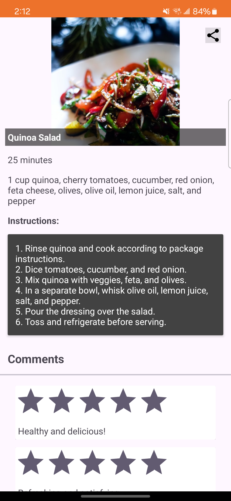
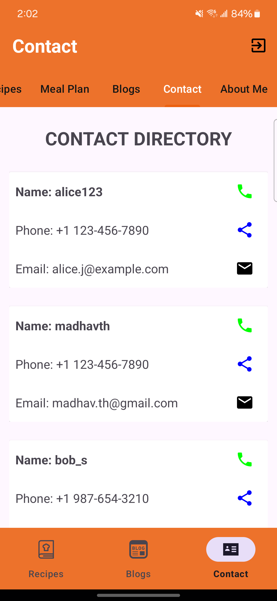

# Path: screenshots/

## Login

## Register User

## Recipe Home Screen

## Recipe Add

## Recipe Detail

## Recipe Share

## Meal Plan Empty

## Meal Plan add

## Meal Plan Added

## Blog Posts

## Blog Posts Add

## Contact Directory

## Send Email Dialog

## Send Email

## About Me

## About Me Edit
